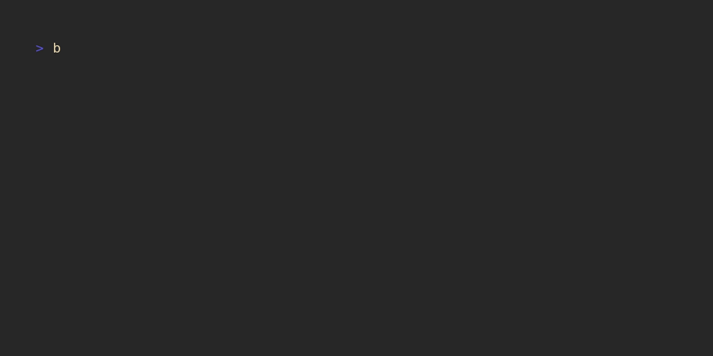

# Blueprinter

Blueprinter is a command-line tool built with Bubble Tea that allows users to browse template files and directories from configured source locations and copy them to a target destination. It provides an interactive list of available templates from which users can select, and then copy the selected item to their current working directory or a specified target directory.



Blueprinter allows fuzzy search and selection from files in configured template directories.


## Installation

Blueprinter can be installed using `go install`

```bash
go install github.com/ptdewey/blueprinter@latest
```

It can also be built from source if desired
```bash
git clone https://github.com/ptdewey/blueprinter.git
cd blueprinter
go build
```

## Usage

Blueprinter is run by calling the executable from the command line.

```bash
# installed with go get (or from source with executable in PATH)
blueprinter

# built from source (not in PATH)
./blueprinter
```

To specify an output location, add an argument for the desired output location.

```bash
# add selected template to the 'example' directory
./blueprinter ./example
```

## Configuration

Blueprinter reads configuration from TOML files, which specify the directories where your template files are located. If no configuration file is found, it falls back to default directories like `~/Templates` or `~/Documents/Templates`.
Blueprinter will treat subdirectories as copyable unless they explicitly end with "-blueprints" (i.e. "gitignore-blueprints")

### Configuration Files

By default, Blueprinter looks for one of the following configuration files in either the current Git repository root (if available) or in the home directory:

- `blueprinter.toml`
- `.blueprinter.toml`
- `.blueprinterrc`
- `.blueprinterrc.toml`
- `blueprinterrc.toml`

These files should contain an array with a `template-sources` key, which lists the directories where your templates are stored.

#### Example Configuration (`blueprinter.toml`)

```toml
templateSources =  [
    "~/Templates",
    "~/Documents/MyCustomTemplates",
]
```

In this example, Blueprinter will look for templates in `~/Templates` and `~/Documents/MyCustomTemplates`.

#### Default Configuration

If no configuration file is found, Blueprinter will try to use the following default directories within the user's home directory:

- `~/Templates`
- `~/Documents/Templates`
- `~/Documents/templates`

If one of these directories exists, it will be used as the default template source. If none of the default directories exist and no configuration file is present, Blueprinter will panic and exit with an error.


### Additional Configuration Options

When called with no arguments, blueprinter will match the filename in the directory, but there are many cases where this is likely not desired (i.e. for .gitignore files).
To account for this, a `.blueprint.toml` file(s) can be placed in the templates directory (or a "-blueprints" subdirectory) to redefine the default output name of all files within that directory or subdirectory.

*Assuming the .blueprint.toml file is in a directory called "gitignore-blueprints"*

```toml
output_name = ".gitignore"
```

This would rename any files in our hypothetical "gitignore-blueprints" directory to `.gitignore`


(Example blueprint folder structure)
```
typst-blueprints
├── .blueprint.toml
├── conf.typ
├── deck.typ
└── document.typ
```


#### `.blueprint.toml` Specification

```toml
# Automatically rename output
output_name = "main.typ"

# Ignore files in list construction
ignore=["conf.typ"]

# Additional configuration options for a single template (can be repeated as many times as necessary)
[[template_config]]
target_template="document.typ" # Template associated with config
extra_templates=["conf.typ"] # Additional files to copy alongside a template
extra_destinations=["conference.typ"] # Output names for extra files

[[template_config]]
target_template="deck.typ"
extra_templates=["slide.typ"]
```

